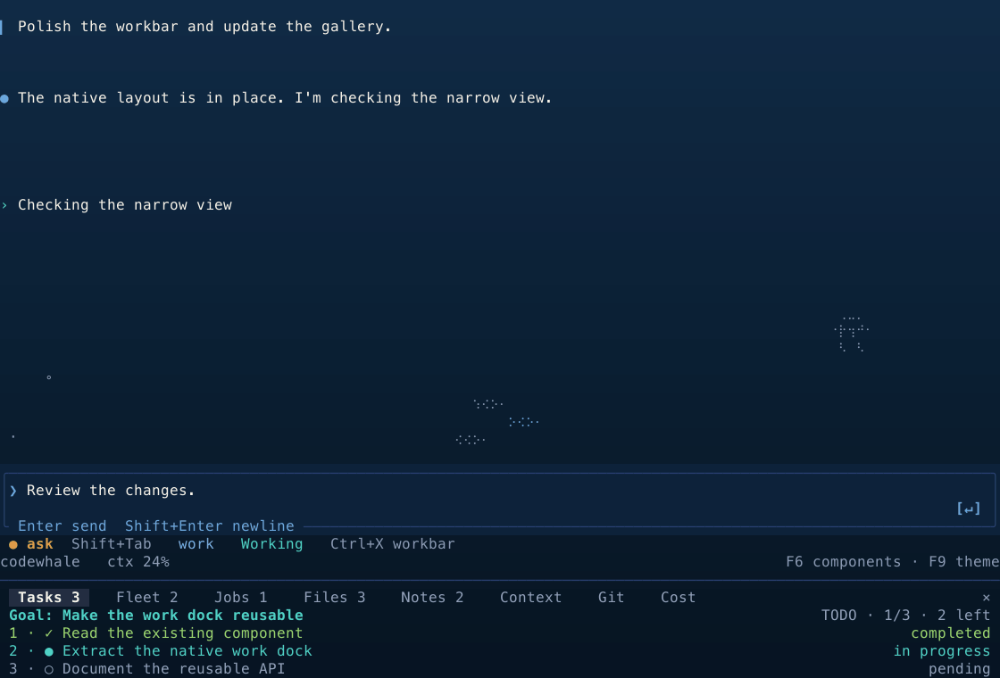
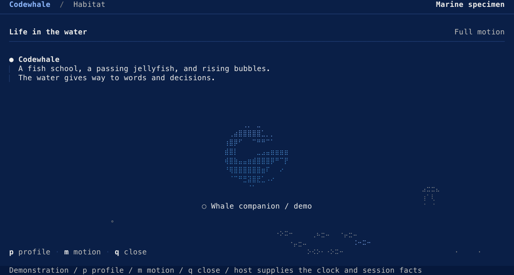

# Codewhale, in your terminal

Reusable [Ratatui](https://ratatui.rs) components from the current
[Codewhale TUI](https://github.com/Hmbown/CodeWhale): its workbar, composer,
conversation, session picker, instrument surfaces, status lines, ocean ombré,
spinners and marine life. Use one component or compose a complete terminal app.

The native **workbar** has Tasks, Fleet, Jobs, Files, Notes, Context, Git and
Cost panels. The **Underwater ocean** uses Codewhale's existing depth colors,
context rise and phase transitions. All **16 fixed TUI themes** are included,
with their own backgrounds and permission, mode and status inks.

Run `cargo run --example showcase` to explore the components together.
Run `cargo run --example gallery` to browse every component and variation.



Start with the native TUI components. Optional desktop-inspired layouts,
additional ombrés and the animated whale give you more ways to compose your
own app. The [view guide](VIEWS.md) connects Codewhale's terminal screens to
these reusable parts; the [component guide](COMPONENTS.md) maps their APIs to
source. Your app supplies its data, clock and actions.

## See the components

These previews are generated from the **actual Ratatui cell buffers** used by
the gallery and snapshot tests. Every gallery entry appears in the dark and
light collections below; the profile comparison shows how the same state
marks adapt to all nine terminal profiles. SVGs contain no remote assets or
scripts. Open an image to inspect it at full size.

The [component crosswalk](COMPONENTS.md) maps the native Codewhale surfaces to
their reusable kit parts. [Design notes](DESIGN.md) explain the water, ink,
motion and host boundaries.

Profiles that leave colors to the terminal use a representative palette in
these images; your terminal supplies its own defaults.

<details>
<summary>Watch the habitat move — full motion demonstration</summary>



Eighty actual terminal-buffer frames. This demonstration holds the jellyfish
visit open; the component normally makes it a rare visitor. Ambient life is
absent under `MotionMode::Reduced` and `Still`. Run `cargo run --example habitat`
to switch the motion policy and all nine terminal profiles yourself.

</details>

<!-- gallery:start -->

Generated from the real ratatui buffers. Every catalogue entry is shown below.

Jump to: [The live component gallery](#the-live-component-gallery) · [Codewhale terminal views](#codewhale-terminal-views) · [The native composer and footer](#the-native-composer-and-footer) · [The native workbar](#the-native-workbar) · [Every Codewhale TUI theme](#every-codewhale-tui-theme) · [Codewhale water and ombres](#codewhale-water-and-ombres) · [Conversation and queued input](#conversation-and-queued-input) · [Conversation and agents](#conversation-and-agents) · [The Codewhale language](#the-codewhale-language) · [Input and selection](#input-and-selection) · [Navigation and controls](#navigation-and-controls) · [Work and results](#work-and-results) · [Motion and feedback](#motion-and-feedback) · [Life in the water](#life-in-the-water) · [A whale with a job](#a-whale-with-a-job) · [Every whale action](#every-whale-action) · [Optional workspace compositions](#optional-workspace-compositions) · [Terminal profiles](#terminal-profiles)

### The live component gallery


<details>
<summary>Watch the WhaleLight gallery and all seventeen native whale actions</summary>


Actual terminal buffers from the live showcase renderer, sampled at its terminal cadence.
The demonstration supplies its work phases; no displayed command runs.
The whale uses the native Director's springs and authored clips, with one host clock.
Run `cargo run --example showcase` to edit, answer, change the palette and explore every component.

</details>

### Codewhale terminal views


### The native composer and footer


### The native workbar


### Every Codewhale TUI theme


### Codewhale water and ombres


### Conversation and queued input


### Conversation and agents


### The Codewhale language


### Input and selection


### Navigation and controls


### Work and results


### Motion and feedback


<details>
<summary>Watch the working and verification spinners, then the receipt arrive</summary>


A demonstration of the actual components at their normal cadence: the working swell,
verification tick, state ink, selection movement and detail reveal.
The demonstration supplies each state change; the component supplies its motion.
Reduced and still modes use readable static marks and settle transitions immediately.
Run `cargo run --example motion` to finish, restart, switch phases and change motion policy yourself.

</details>

### Life in the water


### A whale with a job


### Every whale action


### Optional workspace compositions


<details>
<summary>Light theme</summary>


</details>

### Terminal profiles


<!-- gallery:end -->

## Component catalogue

| Family | Components | What they do |
|---|---|---|
| Optional workspace composition | `WorkspaceFrame`, `WorkspaceAreas`, `PaneHeader`, `ContextRibbon`, `ContextItem` | Responsive conversation and dock regions, one quiet module header, composer-adjacent facts folded by priority with explicit counts |
| Native shell | `TerminalShell`, `ShellAreas` | Current conversation → pending input → composer → posture → workflows → metrics → workbar ordering |
| Native workbar | `Workbar`, `WorkbarPanel`, `WorkbarRow`, `WorkbarState` | All eight panels, goals, row selection, keyboard outcomes, scrolling, hitboxes and bottom/top/side placement |
| Native composer and workflow rows | `NativeComposer`, `WorkflowProgress`, `WorkflowRun` | Rounded input enclosure, prompt, submit control, target chip and borderless workflow progress |
| Native footer | `PostureBar`, `MetricsLine`, `MetricSegment` | Permission and mode, clocks, live counts, context warnings and width-aware model/usage facts |
| Native views | `InstrumentSurface`, `SessionList`, `SessionRow` | TUI title/action rails, quiet gutters, session selection, ranges, search and rename presentation |
| TUI themes | `TuiPalette`, `TuiInk` | All 16 fixed source palettes, exact grounds and distinct native permission/mode/status inks |
| Attention and results | `AttentionQueue`, `AttentionItem`, `ArtifactShelf`, `Artifact` | Project-aware decisions, selected action hints, review/file/run/link results and reported receipts |
| Marine life | `Habitat`, `FishSchool`, `Jellyfish`, `BubbleField`, `HabitatDensity` | Native braille poses and ASCII silhouettes, caller-clock motion, bounded populations, complete visitors and text-safe open-water collision |
| Water and palette | `OceanColumn`, `OceanRamp`, `OceanPhase`, `Ombre`, `WaterPalette` | Native TUI depth column, context rise, steady attention tint, completion breath and five spatial materials; contrast and fallback guards |
| Living whale | `whale_motion::Stage`, `Director`, `ColoredGrid` | One session performance, authored clips and springs, native colored props, shared terminal cadence and hide/resume boundaries |
| Session surfaces | `Message`, `ToolCard`, `Composer`, `AgentCard`, `Fleet` | Speaker anchors, output rails, honest omission counts, caller-owned prompts and each agent's own state, route and task |
| Pending input | `PendingInputPreview`, `PendingInputItem`, `ContextPreviewItem` | Queued, steering, editing, paused and in-flight input; included context and host-dispatched action metadata |
| Rich transcript | `Transcript`, `TranscriptBlock`, `TranscriptSpan`, `CodeBlock` | Authored headings, prose, quotes, lists, tables and numbered code; exact copy source and out-of-band links |
| Identity and state | `Whale`, `WhaleState`, `Icon`, `StatusMark`, `StateWords` | The v2 whale's 17 actions and pods; marks always paired with words; localized state labels |
| Surfaces | `Panel`, `Depth`, `Dialog`, `Sheet`, `HorizonRule` | Deep, stage, raised and overlay grounds; centered decisions, edge-anchored sheets and the composer ledge |
| Navigation | `Heading`, `Tabs`, `KeyHints`, `Keymap`, `Picker`, `List` | Shared heading hierarchy, selection, scrolling, keyboard labels and caller-owned outcomes |
| Input and controls | `TextInput`, `Form`, `Toggle`, `Segmented` | Unicode-aware editing, masked fields, validation and controls that explain disabled state |
| Search and empty states | `PickerQuery`, `PickerTabs`, `PickerMatches`, fuzzy matching helpers, `EmptyState` | Ranked choices, search highlights, tabs, previews and a clear next action when there are no results |
| Work and results | `Receipt`, `ReceiptTable`, `Diff`, `WorkflowTree`, `CountBar` | Measured values, explicit unknowns, numbered additions/removals, workflow hierarchy and progress from known totals |
| Decisions | `ApprovalCard`, `ReviewVerdict`, `ReviewAggregate` | What will happen, where, why, and the caller's available next actions |
| Settings | `SettingRow`, `SettingDetail` | Value, source, lock reason, changed state, apply timing and reset details |
| Feedback and motion | `Toasts`, `Spinner`, `VerificationSpinner`, `MotionStep`, `MotionSet`, `FrameBudget` | Working swell, verification tick, notices, measured elapsed time, bounded transitions and reduced/still motion |

Words and data arrive from the caller, with English defaults where useful.
The kit does not calculate a diff, parse Markdown, validate credentials,
authorize a command, estimate cost or run an agent.

`OceanColumn` is adapted from the current TUI's three native stops:
`#102A45` → `#0A1E33` → `#061320`. Apply it after painting a scene to share
one continuous column behind ordinary grounds. Selections, elevated panels,
diffs and code retain their backgrounds. The host supplies phase, elapsed time
and measured context; quiet policies stop breathing. The dark field is
opt-in on measured truecolor Ocean; light and limited-color terminals retain
their selected grounds.

`Ombre` finishes a painted scene with a spatial palette wash. It preserves
state ink and readable contrast, and leaves unsupported profiles unchanged.
The native TUI column is the studio default; the logo Ocean wash is also
available alongside Lagoon, Dusk, Coral and Graphite.

## Spinners and animation

`Spinner` uses Codewhale's eight-frame swell; `VerificationSpinner` uses the
Engine's distinct round verification tick. Both wait 400 ms before moving,
advance at five steps per second, and keep the caller's work verb visible.
Reduced and still motion show a static mark plus words. ASCII terminals have
their own frames.

`MotionStep` and `MotionSet` handle token-timed state ink, selection movement
and detail reveal. The caller changes the state and supplies the instant;
the state words change immediately. `FrameBudget` combines redraw deadlines
and lets the host claim one primary spinner per frame. Once transitions
settle, the host can wait for input instead of painting identical frames.

The animated demonstrations are under [Motion and feedback](#motion-and-feedback).
The normal gallery samples fixed instants; `cargo run --example motion` is
the live example.

The native whale performance lives in `whale_motion`. A host keeps one `Stage`
per foreground session, reports explicit owner inputs, and advances it on its
own clock. `Tier::Terminal` caps active paints at six per second and rest at
two. Reduced motion uses authored posters; hiding and resuming discard missed
motion. `colored_braille` adds native body and prop inks to the exact packed
geometry. It uses majority visible ink per Braille cell because terminals
provide one foreground per cell. The [source and fixtures](assets/whale-motion/PROVENANCE.md)
pin the native implementation and its conformance oracle.

## Use it

Use this repository as a Git dependency while the crate is developed:

```toml
[dependencies]
codewhale-ratatui = { git = "https://github.com/Hmbown/codewhale-ratatui" }
ratatui = "=0.30.2"
```

Rust 1.89 or later. The kit and host must share the same Ratatui and Crossterm
versions so their buffers, styles and key events are the same types.

```rust
use codewhale_ratatui::{
    Depth, KeyHint, KeyHints, Paint, Panel, Picker, PickerItem, PickerState, Theme,
};

// Once, after enabling raw mode, if the host does not already detect it:
codewhale_ratatui::detect::probe_terminal_background();
let theme = Theme::detect().tui();

// In your draw callback, with a Ratatui area and buffer:
let hints = KeyHints::new(vec![
    KeyHint::new("↑↓", "move"),
    KeyHint::new("Enter", "select"),
    KeyHint::new("Esc", "cancel"),
]);
let inner = Panel::new(Depth::Overlay)
    .title("Mode")
    .hints(&hints)
    .draw(area, buf, &theme);
let items = [PickerItem::new("Work").key('1'), PickerItem::new("Plan").key('2')];
Picker::new(&items, PickerState::new(0)).paint(inner, buf, &theme);
```

Every `Paint` component also becomes a Ratatui widget with `.themed(&theme)`:

```rust
use codewhale_ratatui::{NativeComposer, Paint, Theme};
let theme = Theme::detect().tui();
let composer = NativeComposer::new("Review the changes")
    .target("my-project / main");
frame.render_widget(composer.themed(&theme), frame.area());
```

Compose the native conversation layout:

```rust
use codewhale_ratatui::{
    Message, NativeComposer, Paint, PostureBar, TerminalShell,
    Workbar, WorkbarPanel, WorkbarRow,
};

let composer = NativeComposer::new("Review the changes").focused(true);
let workbar = Workbar::new(WorkbarPanel::Tasks, vec![
    WorkbarRow::new("task:review", "Review the changes").mark("●"),
]);
let shell = TerminalShell::new(composer.desired_height(area.width, area.height))
    .workbar_rows(workbar.height(area.width, &theme));
shell.paint(area, buf, &theme);
let regions = shell.areas(area);
Message::native("The changes are ready for review.").paint(regions.conversation, buf, &theme);
composer.paint(regions.composer, buf, &theme);
PostureBar::new("ask").paint(regions.posture, buf, &theme);
workbar.paint(regions.workbar, buf, &theme);
```

Choose a native background and keep the same components:

```rust
use codewhale_ratatui::{Theme, TuiPalette};
let theme = Theme::detect().tui_palette(TuiPalette::TokyoNight);
```

`Theme::tui()` chooses Underwater for a dark terminal and WhaleLight for a
light terminal. `Whale` and `WhaleLight` preserve the terminal-owned shell
backgrounds from the TUI. `Theme::new` also supports the existing desktop
role-token theme; `Ombre` offers additional spatial treatments. Native view
recipes are in [src/gallery/native_views.rs](src/gallery/native_views.rs).

For open water, paint foreground content first, then call `Habitat::paint`.
It protects occupied cells and their clearance; the entire jellyfish is
withheld when its silhouette cannot fit. Pass decision and overlay rectangles
to `Habitat::protected` so their blank space stays protected too. Keep a
dedicated habitat viewport separate from any decision overlay. The habitat
never requests a frame itself. Selection and pointer helpers use the same clipped
viewport passed to painting.

The whale's ordinary `Paint` implementation shows its current poster pose.
For animation, pass the packed `whale::Grid` evaluated by your existing
owner to `Whale::paint_frame(area, buf, &theme, &grid)`. The widget paints that
exact frame and its state words; it owns no Director or clock. The whole
frame must fit, with a row for the label. Invalid, narrow or ASCII frames
fall back to words. Repaint the underlying surface first because empty
cells in the frame are transparent. For the native animated performance, use `whale_motion::Stage` and
`colored_braille`; the [showcase host](examples/showcase.rs) demonstrates the
shared clock and motion policy.

The [gallery fixtures](src/gallery/) are runnable usage examples for every
family. [Component contribution instructions](CONTRIBUTING-COMPONENTS.md)
explain the rendering and ownership contracts.

## Choose a terminal profile

- **Truecolor:** native TUI presets retain exact source inks and grounds.
  `Theme::tui()` selects the native default; desktop role-token mode is also available.
- **256 colors:** native preset RGBs use the nearest fixed-cube index. Desktop
  role-token mode uses its contrast-audited table.
- **16 colors or unknown ground:** named terminal colors and visible marks/edges;
  the terminal owns the background.
- **`NO_COLOR`:** words, weight and marks carry every state.
- **`CODEWHALE_ASCII_SAFE=1`:** component chrome uses ASCII glyphs; user-authored
  Unicode remains text supplied by the host.

Set `CODEWHALE_APPEARANCE=light` or `dark` if the ground cannot be measured.
A host with its own detection can pass `Theme::new(Caps { depth, ascii,
appearance })` and avoid a second probe. Changes to a theme reach components
on their next paint; components hold roles rather than cached colors.

## Browse and regenerate

```sh
cargo run --example gallery                          # interactive catalogue
cargo run --example showcase                         # the full terminal studio
cargo run --example habitat                          # live fish, jellyfish, bubbles
cargo run --example motion                           # working, verification and transitions
cargo run --example gallery -- --print dark-256     # ANSI preview to stdout
cargo run --example gallery -- --dump out/          # .ans and styled .txt, all profiles
cargo run --example gallery -- --svg target/readme-buffers
python3 tools/render-gallery.py target/readme-buffers assets/readme --readme README.md
python3 tools/render-gallery.py target/readme-buffers assets/readme --readme README.md --check
```

The optional animation build needs Node, `sharp` and FFmpeg. Each animation
comes from deterministic actual-buffer frames, using one shared media builder:

```sh
cargo run --locked --example habitat -- --frames target/habitat-frames
node tools/render-animation.cjs target/habitat-frames assets/readme/habitat-motion.gif
python3 tools/check-animation.py target/habitat-frames assets/readme/habitat-motion.gif
cargo run --locked --example motion -- --frames target/motion-frames
node tools/render-animation.cjs target/motion-frames assets/readme/motion-demo.gif
python3 tools/check-animation.py target/motion-frames assets/readme/motion-demo.gif
cargo run --locked --example motion -- --frames target/motion-light-frames --profile light-truecolor
node tools/render-animation.cjs target/motion-light-frames assets/readme/motion-demo-light.gif
python3 tools/check-animation.py target/motion-light-frames assets/readme/motion-demo-light.gif
cargo run --locked --example showcase -- --frames target/showcase-frames
node tools/render-animation.cjs target/showcase-frames assets/readme/showcase.gif
python3 tools/check-animation.py target/showcase-frames assets/readme/showcase.gif
cargo run --locked --example showcase -- --frames target/showcase-light-frames --profile light-truecolor
node tools/render-animation.cjs target/showcase-light-frames assets/readme/showcase-light.gif
python3 tools/check-animation.py target/showcase-light-frames assets/readme/showcase-light.gif
cargo run --locked --example showcase -- --frames target/whale-action-frames --section life
node tools/render-animation.cjs target/whale-action-frames assets/readme/whale-performance.gif
python3 tools/check-animation.py target/whale-action-frames assets/readme/whale-performance.gif
```

CI verifies both the current frame hash and the GIF file hash; it needs no
raster tools. Static previews and the live terminal example use the normal
Rust/Python toolchain.

In the interactive gallery: `↑↓` or `j/k` selects a component, `p/P` switches
terminal profile, `w/W` switches width, `PgUp/PgDn` scrolls tall previews,
`Home/End` jumps through them, and `q` or `Esc` exits. This includes the full
17-action whale sheet on an ordinary-height terminal. `f` expands the canvas
for the composed workspace scenes. The habitat example uses `p` for profile,
`m` for motion and `q` to close.
In the motion example, `Space` finishes or restarts the demonstration, `v`
switches working/verification, `r` replays, `p` changes profile, and `m`
changes motion policy. `q` or `Esc` closes it.

In the studio, `F1`–`F6` choose the six sections. `F7` changes terminal profile,
`F8` motion policy, `F9` native TUI theme, and `F10` the example work phase. `Tab` moves
focus; `Enter` edits; `Esc` keeps the draft. The decision accepts an explicit
answer. Life uses `←→` to study an action and `Space` to play all seventeen.
In Work, `Ctrl+X` opens Fleet, `Alt+W` focuses the workbar, and Left/Right
switches its panel while focused. `Esc` closes the dock. Color controls select
optional ombré washes separately from the native F9 theme.
Components supports search and tall-preview scrolling. `Ctrl+R` restarts the
demonstration; `q` or `Esc` closes outside editing.

Profiles: `dark-truecolor`, `dark-graphite`, `light-truecolor`, `dark-256`,
`light-256`, `ansi-16`, `unknown-ground`, `no-color`, `ascii`.

## Verify it

```sh
cargo fmt --check
cargo clippy --all-targets --locked -- -D warnings
cargo test --locked
cargo test --example gallery --locked
python3 vendor/codewhale-design/generate.py --check
```

Snapshots record the role each run uses, alongside its glyphs. Tests exercise
profiles and widths, Unicode input, missing data, clipped output and disabled
controls. The generated README boards can be checked separately with the
command above. GitHub CI qualifies the branch; a local pass proves local
behavior only.

## Update source palettes and design assets

The native TUI palette export retains the source's backgrounds, permission,
mode and status slots. With a current Codewhale checkout:

```sh
python3 tools/export-tui-palettes.py ../codewhale
python3 tools/export-tui-palettes.py ../codewhale --check
```

Tokens are vendored from the private `codewhale-design` source. Maintainers
with that checkout can sync and regenerate:

```sh
../codewhale-design/scripts/sync-to.sh .
CODEWHALE_BLESS=1 cargo test --test generated
```

`src/roles.rs` is generated from the tokens, including terminal-derived hint,
dim and diff-tint roles. Contrast tests cover truecolor and quantized colors.

`assets/whale-v2.scenes` holds contours exported from the v2 whale kit. To
update or check them with that source available:

```sh
node tools/export-whale.cjs <path-to-whale-character-v2>
node tools/export-whale.cjs <path-to-whale-character-v2> --check
```

`tests/whale.rs` checks all 17 actions against the kit's 32×16 and 20×10 stills,
dot for dot. Artwork shows up to three calves; the state label gives the true
agent count, including larger fleets. Compact or ASCII terminals keep the
state in words when the art cannot fit.

## Integration status and license

The foundation was extracted from the Codewhale Engine
([Hmbown/CodeWhale](https://github.com/Hmbown/CodeWhale) at `58b1dd3dd`) and
extended here. The Engine has not migrated onto this crate yet. Completing
this library and its gallery does not establish Engine adoption or a release.

MIT. See [LICENSE](LICENSE).
